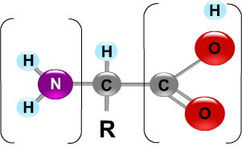
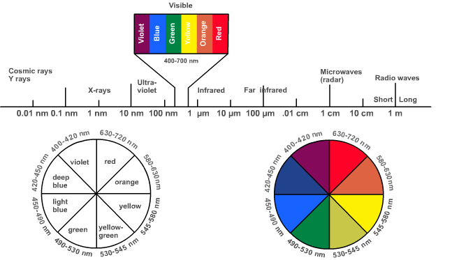

### Theory:
 
Amino acids are known as the building blocks of all proteins. There are 20 different amino acids  commonly found in proteins. Amino acids are comprised of a carboxyl group and an amino group attached to the same carbon atom (the α carbon).

They  vary in size, structure, electric charge and solubility in water because of the variation in their side chains ( R groups).  Detection, quantification and identification of amino acids in any sample constitute important steps in the study of proteins.

The general structure of an amino acid is shown below:  

&nbsp;

Alpha amino acids react with Ninhydrin involved in the development of color which is explained by the following five steps.

&nbsp;

### 1.   alpha-amino acid + Ninhydrin ---> Reduced ninhydrin  +Alpha amino acid +H2O

&nbsp;

This is an oxidative deamination reaction that elicit two hydrogen from the alpha amino acid to produce an alpha – imino acid. Also the ninhydrin reduced and loses an oxygen atom with the formation of water molecule.

&nbsp;

### 2.     alpha-amino acid + H2O ---> alpha-keto acid +NH3

&nbsp;

The rapid hydrolysis of  NH group in the alpha – imino acid will cause the formation of  an alpha- keto acid with an ammonia molecule. This alpha-keto acid further involved in the decarboxylation reaction of step.

&nbsp;

### 3.     alpha-keto acid + NH3 ---> aldehyde + CO2

&nbsp;

Under  a heated  condition  to  form an aldehyde  that  has  one  less  carbon  atom  than  the  original  amino  acid. A  carbon  dioxide molecule  is  produced along with aldehyde. These  first  three steps produce  the  reduced ninhydrin and ammonia  that are  required  for  the  production  of  color .The  overall reaction for the above reactions is simply explained in Reaction (4) as follows:

&nbsp;

### 4.    alpha-amino  acid  +  2  ninhydrin  --->  CO2  +  aldehyde  +  final complex(BLUE) + 3H2O

&nbsp;

In summary, ninhydrin, which is originally yellow, reacts with amino acid and turns deep  purple. It is this purple color that is detected in this method.  Ninhydrin  will  react  with  a  free  alpha-amino  group,  NH2-C-COOH.  This group is present  in all amino acids, proteins or peptides. Whereas, the decarboxylation reaction  will  proceed  for  a  free  amino  acid,  it will  not  happen  for  peptides  and  proteins. Theoretically only amino acids produce color with ninhydrin reagent. However, one should  always  check  out  the  possible  interference  from  peptides  and  proteins  by  performing  blank  tests  especially when  such  solutions  are  readily  available. For  example,  one  can  simply  add  the ninhydrin  reagent  to  a  solution  of  only  proteins  and  see  if  there  is  any  color development. There  is no excuse  for  failing  to perform  such a vital  test when  the sample  mixture  contains  both  proteins  and  amino  acids.  There  are  also  reports  that chemical compounds other than amino acids also respond positively to this reaction.

&nbsp;

The ninhydrin reaction, one of the most important method of detecting amino acids, both technically and historically, has been conventionally used to detect their microgram amounts. When amino acids with a free alpha amino groups are treated with an excess of ninhydrin, they yield a purple colored product. Under appropriate conditions, the color intensity produced is proportional to the amino acid concentration.

 
&nbsp;

The primary amino groups react with ninhydrin to form the purple colour dye now called Ruhemann's purple (RP) was discovered by Siegfried Ruhemann in 1910. Iminoacids like   proline, the guanidino group of arginine, the amide groups of asparagine, the indole ring of tryptophan, the sulfhydryl group of cysteine, amino groups of cytosine and guanine, and cyanide ions also react with ninhydrin to form various chromophores that can be analyzed.

&nbsp;

The overall reaction can be written as follows:

&nbsp;

Primary amines also react with ninhydrin, but do not liberate of CO2. [ Caution : Ninhydrin is a very reactive oxidizing agent, so should be handled with care].

&nbsp;

Several other convenient reagents are available which can react with the alpha amino group to form colored or fluorescent derivatives. These include fluorescamine, dansyl chloride, dabsyl chloride, etc., used in the detection of trace amounts of amino acids at the nanogram level.

&nbsp;

In the quantitative estimation of amino acid using Ninhydrin reagent, the absorbance of the Ruhemann's purple formed by the reaction at 570nm is measured. For imino acids, the absorbtion happens at 440nm. The principle behind the colorimetric estimation is given below:

&nbsp;

## Principle of the Colorimeter:

&nbsp;

 
### Measurement of Absorbance (A):
 

Unknown compounds may be identified by their characteristic absorption spectra in the ultraviolet, visible or infrared regions. Enzyme-catalysed reactions frequently can be followed by measuring spectrophotometrically the appearance of a product or disappearance of a substrate. A spectrophotometer /colorimeter is an instrument for measuring the absorbance of a solution by measuring the amount of light of a given wavelength that is transmitted by a sample.  

&nbsp;

### Light and Spectrum profile:
 

Light can be categorized according to its wavelength. Figure 1 shows the relationship between the wavelength of light and the common types of electromagnetic radiation. Light in the short wavelengths of 200 to 400 nm is referred to as ultraviolet (UV). Light in the longer wavelengths of 700 to 900 nm is referred to as near infrared (near IR).  

&nbsp;

Visible light falls between the wavelengths of 400 and 700 nm. All the colors visible to human eye falls under this wavelength range. Any solution that contains a compound that absorbs light in the visible region will appear colored to the eye. The solution is colored because specific wavelengths of light are absorbed as they pass through the solution. Then, the only light that the eye will perceive are the wavelengths of light that are transmitted (not absorbed).  

&nbsp;

### Beer-Lambert Law:
 

The Beer-Lambert Law states that the amount of light absorbed is proportional to the number of molecules of absorbing substance in the light path, ie., absorption is proportional both to the concentration of the sample solution and to the length of the light path through the solution. This relationship can be expressed as follows:                                                                                                 

&nbsp;

Absorbance, A= ε x c x l

&nbsp;

c = concentration of the sample (in Moles/liter),

l = length of the light path through the solution (in cm) 

ε = molar extinction coefficient 

&nbsp;

 

To determine the absolute concentration of a pure substance, a standard curve is constructed from the known concentrations and using that standard curve, the absorbance reading of the unknown concentration was determined. The determination of unknown concentration from the standard curve is done by drawing a  line parallel to the X- axis  from the point on the Y axis that corresponds to the absorbance of the unknown. This line will be made to intersect the standard curve drawn, and is extended vertically such that it meets the X-axis and the concentration of unknown is read from the   X-axis. A typical standard curve is depicted in the figure.  

